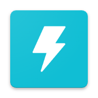
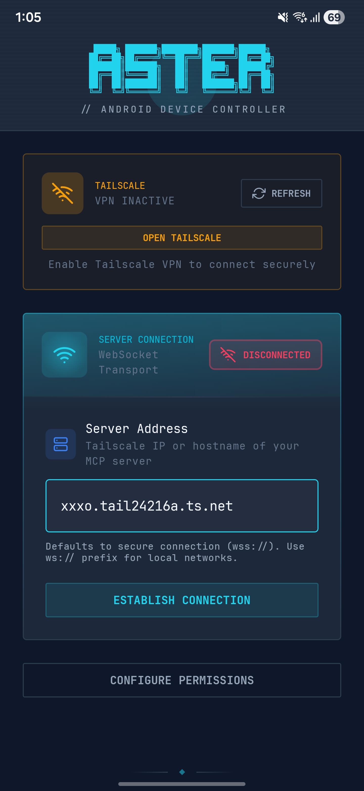
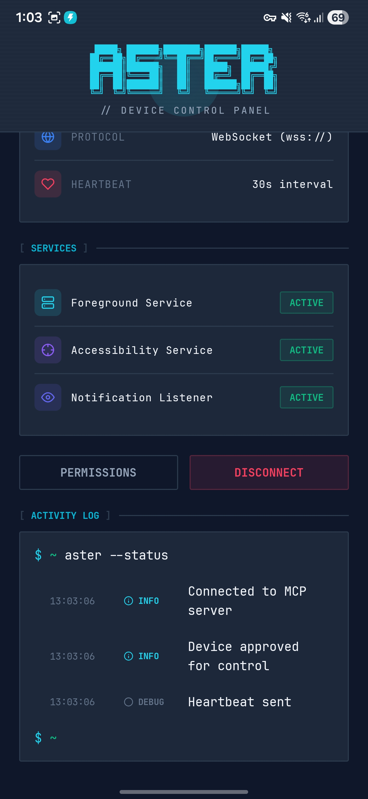
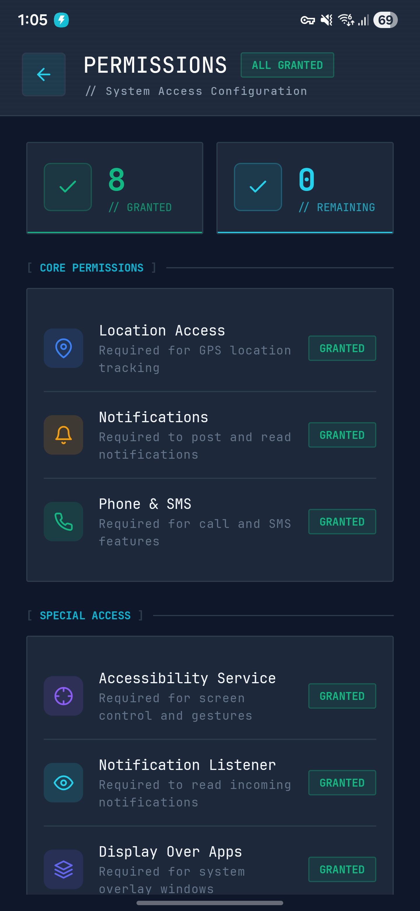
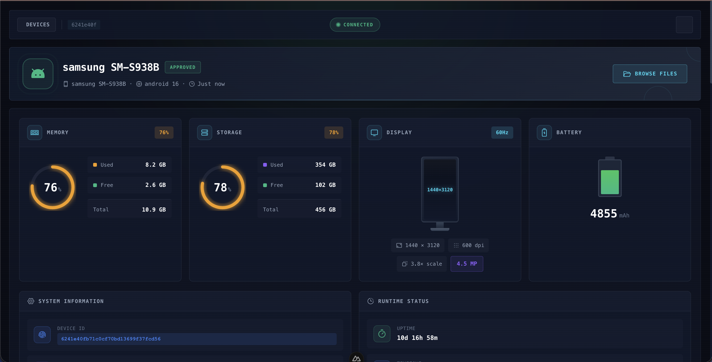
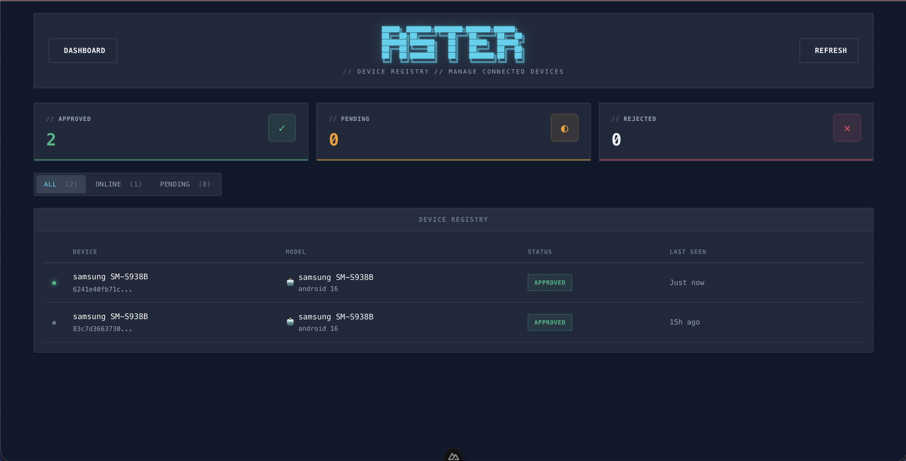
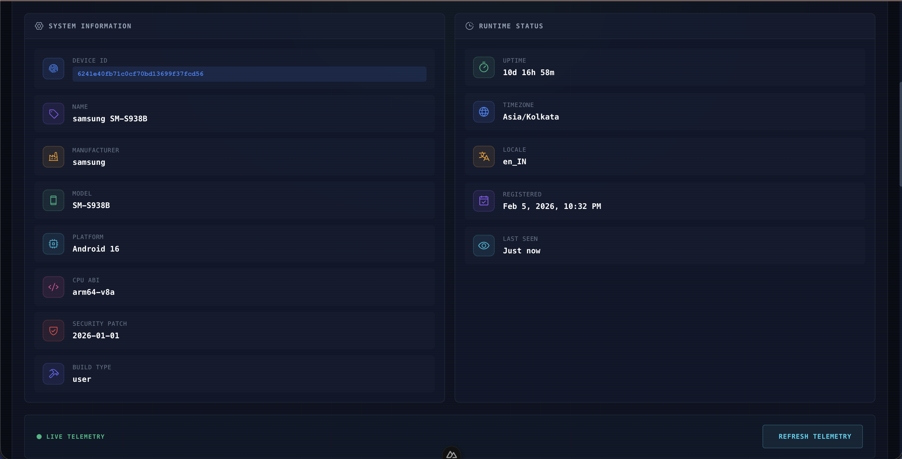
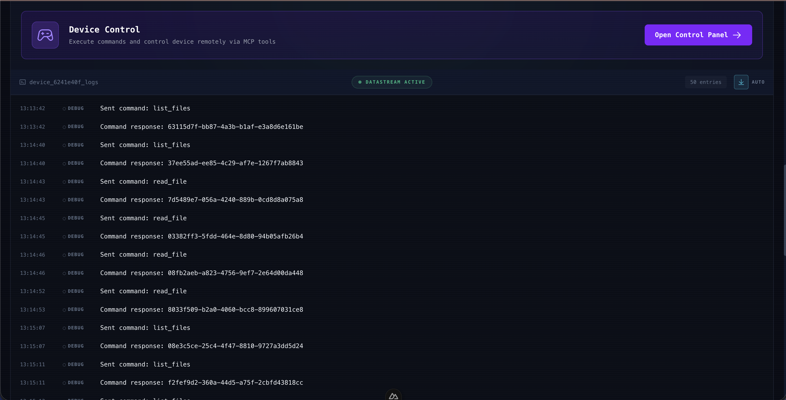

<p align="center">
  
</p>

<h1 align="center">Aster</h1>

<p align="center">
  <strong>Control your Android device with AI</strong>
</p>

<p align="center">
  <a href="https://www.npmjs.com/package/aster-mcp"></a>
  <a href="https://www.npmjs.com/package/aster-mcp"></a>
  <a href="https://github.com/satyajiit/aster-mcp/blob/main/LICENSE"></a>
  <a href="https://clawhub.ai/satyajiit/aster"></a>
  <a href="https://openclaw.ai"></a>
</p>

<p align="center">
  <a href="#features">Features</a> •
  <a href="#quick-start">Quick Start</a> •
  <a href="#usage">Usage</a> •
  <a href="#integrations">Integrations</a> •
  <a href="#mcp-tools">MCP Tools</a>
</p>

---

**Aster** bridges your Android device to AI assistants like Claude through the [Model Context Protocol (MCP)](https://modelcontextprotocol.io/). Take screenshots, automate UI interactions, manage files, read notifications, and more — all through natural language.

<p align="center">
  
  &nbsp;&nbsp;
  
  &nbsp;&nbsp;
  
  &nbsp;&nbsp;
  
</p>

<p align="center">
  <sub>Connection Setup &nbsp;&bull;&nbsp; Device Dashboard &nbsp;&bull;&nbsp; Services & Activity Log &nbsp;&bull;&nbsp; Permissions</sub>
</p>

## Features

- **Screen Control** — Take screenshots, analyze UI hierarchy, tap, swipe, and type
- **App Automation** — Launch apps, click buttons by text/ID, navigate with gestures
- **Device Access** — Read notifications, SMS, clipboard, location, and battery info
- **File Management** — Browse, read, write, and delete files on device storage
- **Media Search** — Find photos and videos using natural language queries
- **System Actions** — Back, Home, Recents, volume control, and more

## Web Dashboard

Aster ships with a built-in web dashboard for managing devices, browsing files, and testing MCP tools.

<p align="center">
  
  &nbsp;
  
</p>
<p align="center">
  
  &nbsp;
  
</p>

<p align="center">
  <sub>Dashboard Overview &nbsp;&bull;&nbsp; Device Telemetry &nbsp;&bull;&nbsp; File Browser & Preview &nbsp;&bull;&nbsp; MCP Tool Explorer</sub>
</p>

<details>
<summary>More screenshots</summary>
<br>
<p align="center">
  
  &nbsp;
  
</p>
<p align="center">
  
  &nbsp;
  
</p>
<p align="center">
  <sub>Device Registry &nbsp;&bull;&nbsp; System Info &nbsp;&bull;&nbsp; Device Control &nbsp;&bull;&nbsp; File Browser</sub>
</p>
</details>

## Quick Start

### 1. Install the MCP Server

```bash
npm install -g aster-mcp
```

### 2. Install the Android App

Download the Aster companion app from [Releases](https://github.com/satyajiit/aster-mcp/releases) and install it on your Android device.

### 3. Start the Server

```bash
aster start
```

### 4. Connect Your Device

Open the Aster app on your Android device and enter the server address shown in the terminal.

### 5. Configure Your AI Client

See [Integrations](#integrations) for Claude, OpenClaw, Moltbot, Clawbot, and other MCP clients.

## Usage

### CLI Commands

```bash
aster start              # Start the server
aster stop               # Stop the server
aster dashboard          # Open web dashboard

aster devices list       # List connected devices
aster devices approve    # Approve a pending device
aster devices reject     # Reject a device
aster devices remove     # Remove a device
```

### Example Prompts

Once connected, try these with Claude:

> "Take a screenshot of my phone"

> "Open YouTube and search for cooking videos"

> "Read my latest notifications"

> "Find photos from my trip to Mumbai last month"

> "What apps are using the most storage?"

## Integrations

### Claude Code / Claude Desktop

Add to your `.mcp.json` or Claude settings:

```json
{
  "mcpServers": {
    "aster": {
      "type": "http",
      "url": "http://localhost:5988/mcp"
    }
  }
}
```

### OpenClaw / Moltbot / Clawbot

Aster is available as a skill on [ClawHub](https://clawhub.ai/satyajiit/aster). Install it directly:

```bash
clawhub install satyajiit/aster
```

Or add manually to your OpenClaw/Moltbot/Clawbot skills directory and configure the MCP endpoint.

### Any MCP-Compatible Client

Aster exposes a standard MCP HTTP endpoint at `http://localhost:5988/mcp` that works with any MCP-compatible AI client.

## MCP Tools

| Category | Tools |
|----------|-------|
| **Screen** | `take_screenshot`, `get_screen_hierarchy`, `find_element` |
| **Input** | `input_gesture`, `input_text`, `click_by_text`, `click_by_id` |
| **Navigation** | `global_action`, `launch_intent` |
| **Device** | `list_devices`, `get_device_info`, `get_battery`, `get_location` |
| **Notifications** | `read_notifications`, `read_sms`, `post_notification` |
| **Files** | `list_files`, `read_file`, `write_file`, `delete_file` |
| **Storage** | `analyze_storage`, `find_large_files`, `search_media` |
| **Clipboard** | `get_clipboard`, `set_clipboard` |
| **Audio** | `speak_tts`, `play_audio`, `vibrate` |
| **Apps** | `list_packages`, `execute_shell` |

## Architecture

```
┌─────────────────┐     WebSocket      ┌─────────────────┐
│                 │◄──────────────────►│                 │
│  Aster Server   │                    │  Android App    │
│  (Node.js)      │                    │  (Accessibility │
│                 │                    │   Service)      │
└────────┬────────┘                    └─────────────────┘
         │
         │ MCP (HTTP)
         │
┌────────▼────────┐
│                 │
│  Claude / AI    │
│                 │
└─────────────────┘
```

## Project Structure

```
Aster/
├── apps/android/     # Android companion app
├── mcp/              # MCP server (npm: aster-mcp)
└── skill/            # ClawHub skill
```

## Requirements

- **Server**: Node.js >= 20
- **Android**: Android 7.0+ with Accessibility Service enabled
- **Network**: Device and server on same network (or Tailscale)

## Tailscale Support

Aster automatically detects Tailscale and displays your Tailscale IP for easy remote connections without port forwarding.

## License

MIT © [Satyajit Pradhan](https://github.com/satyajiit)

---

<p align="center">
  <sub>Built with ❤️ for the AI-first future</sub>
</p>
