<p align="center">
  
</p>

<h1 align="center">Aster</h1>

<p align="center">
  <strong>Your AI CoPilot on Mobile — or give your AI its own phone</strong>
</p>

<p align="center">
  <a href="https://www.npmjs.com/package/aster-mcp"></a>
  <a href="https://www.npmjs.com/package/aster-mcp"></a>
  <a href="https://github.com/satyajiit/aster-mcp/blob/main/LICENSE"></a>
  <a href="https://clawhub.ai/satyajit/aster"></a>
  <a href="https://openclaw.ai"></a>
  
  
  
  
</p>

<p align="center">
  
  
  
  
  
  
  
  
  
  
</p>

<p align="center">
  <a href="#features">Features</a> •
  <a href="#quick-start">Quick Start</a> •
  <a href="#usage">Usage</a> •
  <a href="#integrations">Integrations</a> •
  <a href="#mcp-tools">MCP Tools</a>
</p>

<p align="center">
  
</p>

---

**Aster** bridges any Android device to AI assistants like Claude through the [Model Context Protocol (MCP)](https://modelcontextprotocol.io/). Use it as your AI CoPilot on mobile — or plug a spare Android into a charger, install Aster, and give your AI its own device. It can call you, text you, monitor notifications, and act on its own. Screenshots, UI automation, file management, media search, and 49 tools — all through natural language.

<p align="center">
  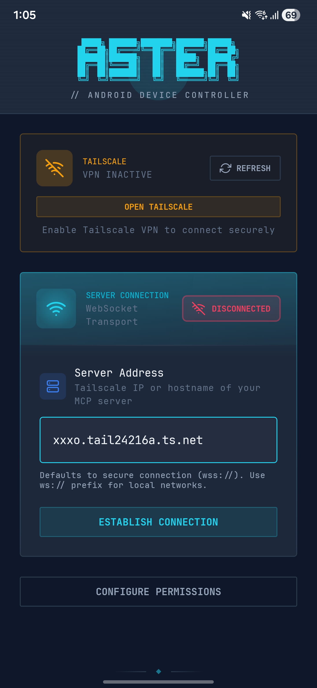
  &nbsp;&nbsp;
  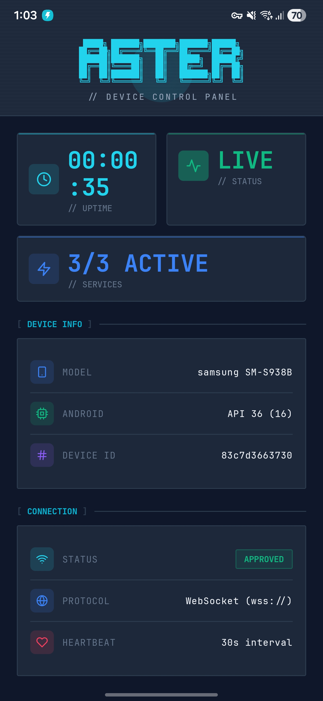
  &nbsp;&nbsp;
  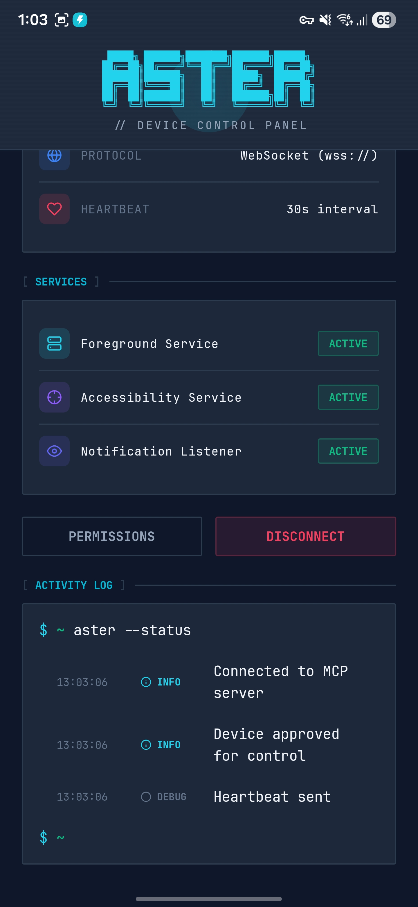
  &nbsp;&nbsp;
  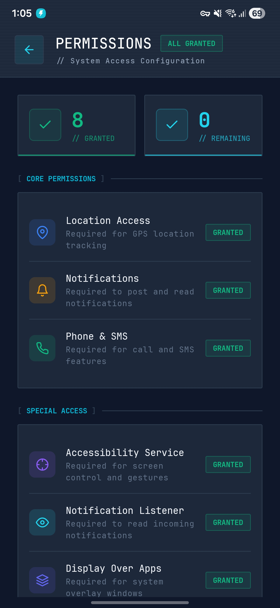
</p>

<p align="center">
  <sub>Connection Setup &nbsp;&bull;&nbsp; Device Dashboard &nbsp;&bull;&nbsp; Services & Activity Log &nbsp;&bull;&nbsp; Permissions</sub>
</p>

## Features

- **Screen Control** — Take screenshots, analyze UI hierarchy, tap, swipe, and type
- **App Automation** — Launch apps, click buttons by text/ID, navigate with gestures
- **Device Access** — Read notifications, SMS, clipboard, location, and battery info
- **File Management** — Browse, read, write, and delete files on device storage
- **Media Search** — Find photos and videos using natural language queries
- **Calls, SMS & Voice** — Make calls, send SMS, or use `make_call_with_voice` to dial and speak a TTS message on speakerphone
- **System Actions** — Back, Home, Recents, volume control, and more
- **Camera & Video** — Take photos or record video remotely — pet cam, baby monitor, security checks
- **Proactive Events** — Your AI reacts to incoming SMS, notifications, and device events in real-time via webhooks
- **AI's Own Phone** — Dedicate a spare Android to your AI. It monitors, calls, texts, and acts on its own

## Web Dashboard

Aster ships with a built-in web dashboard for managing devices, browsing files, and testing MCP tools.

<p align="center">
  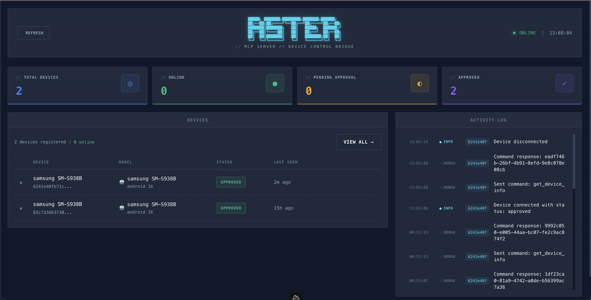
  &nbsp;
  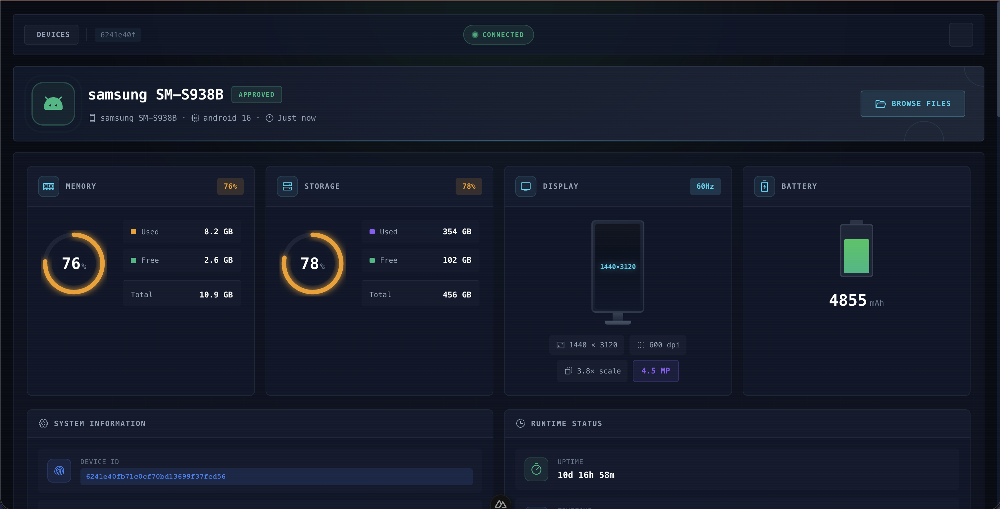
</p>
<p align="center">
  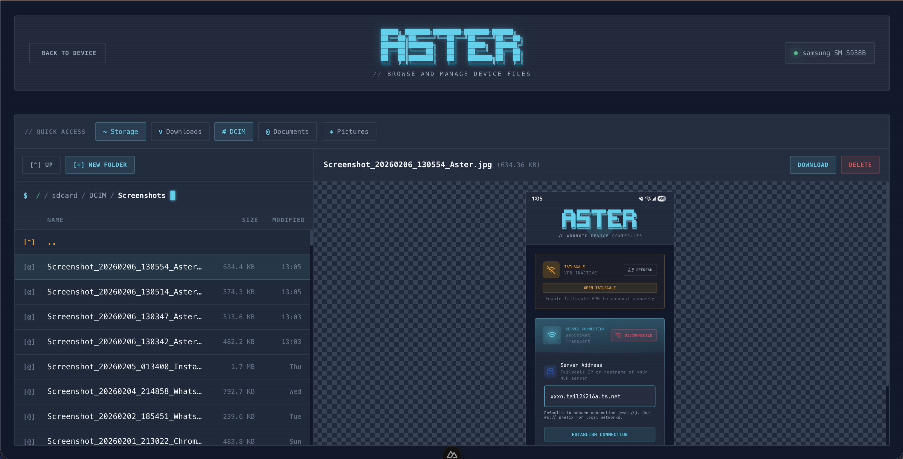
  &nbsp;
  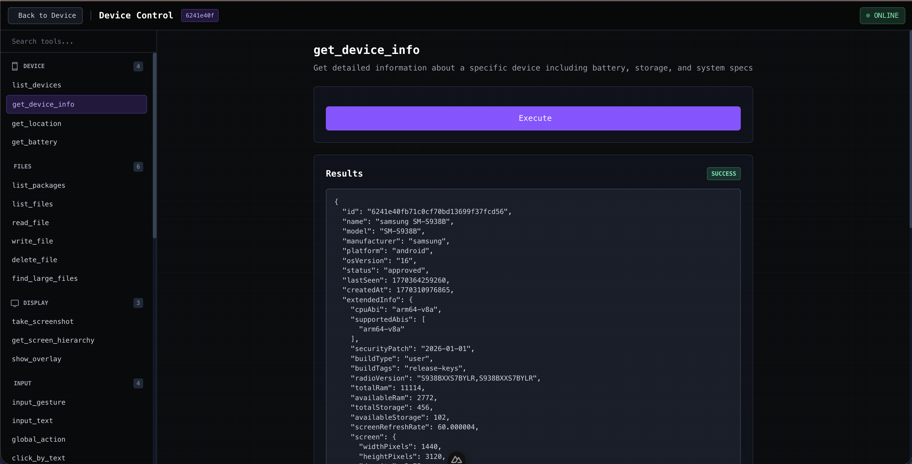
</p>

<p align="center">
  <sub>Dashboard Overview &nbsp;&bull;&nbsp; Device Telemetry &nbsp;&bull;&nbsp; File Browser & Preview &nbsp;&bull;&nbsp; MCP Tool Explorer</sub>
</p>

<details>
<summary>More screenshots</summary>
<br>
<p align="center">
  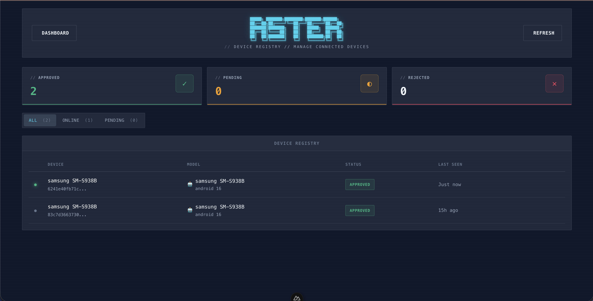
  &nbsp;
  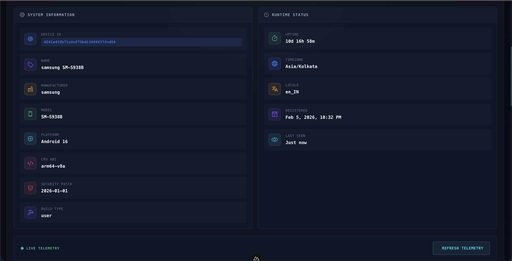
</p>
<p align="center">
  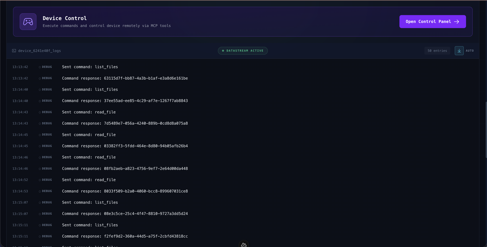
  &nbsp;
  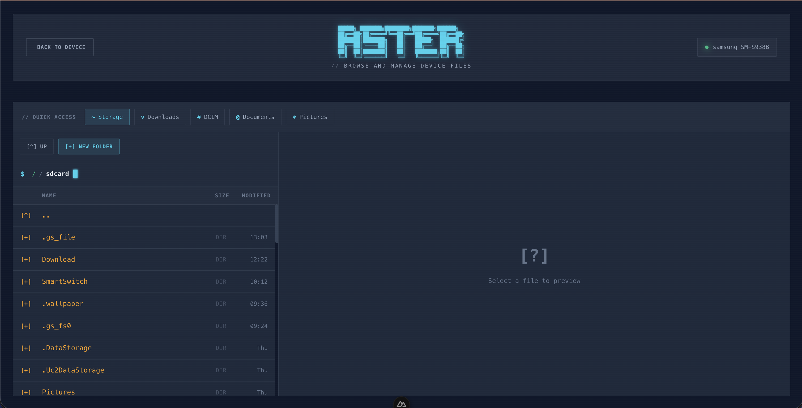
</p>
<p align="center">
  <sub>Device Registry &nbsp;&bull;&nbsp; System Info &nbsp;&bull;&nbsp; Device Control &nbsp;&bull;&nbsp; File Browser</sub>
</p>
</details>

## Quick Start

### 1. Install the MCP Server

```bash
npm install -g aster-mcp
```

### 2. Install the Android App

Download the Aster companion app from [Releases](https://github.com/satyajiit/aster-mcp/releases) and install it on your Android device — your daily phone or a spare one you want to dedicate to your AI.

### 3. Start the Server

```bash
aster start
```

### 4. Connect Your Device

Open the Aster app on your Android device and enter the server address shown in the terminal. For a dedicated AI phone, just plug it into a charger and leave it connected — your AI now has its own device.

### 5. Configure Your AI Client

See [Integrations](#integrations) for Claude, OpenClaw, Moltbot, Clawbot, and other MCP clients.

## Usage

### CLI Commands

```bash
aster start              # Start the server (with optional event forwarding setup)
aster stop               # Stop the server
aster status             # Show server and device status
aster dashboard          # Open web dashboard

aster devices list       # List connected devices
aster devices approve    # Approve a pending device
aster devices reject     # Reject a device
aster devices remove     # Remove a device

aster set-openclaw-callbacks  # Configure proactive event forwarding
```

### Status & Health Checks

Need to confirm the server is up before pointing an agent at it? Three surfaces:

```bash
aster status                              # human-readable server + device snapshot
curl http://localhost:5988/api/health     # -> { "status": "ok", "timestamp": ... }
curl http://localhost:5988/api/stats      # device counts
```

`aster status` reads `~/.aster/status.json`, written by the running server. The `/api/health` endpoint is the one to poll from scripts and monitors.

### Example Prompts

Once connected, try these with your AI assistant:

**Your CoPilot on Mobile:**

> "Take a screenshot of my phone"

> "Open YouTube and search for cooking videos"

> "Read my latest notifications"

> "Find photos from my trip to Mumbai last month"

> "What apps are using the most storage?"

**AI's own phone — let it act for you:**

> "Call me if my flight gets delayed and tell me the new time" *(uses make_call_with_voice)*

> "Text me when my delivery arrives" *(uses send_sms)*

> "Back up new photos to Google Drive every night"

## Proactive Event Forwarding

Aster can push real-time events from the phone to your AI agent via webhook. Your AI reacts the moment something happens — no polling needed.

| Event | Example |
|-------|---------|
| **SMS** | Auto-reply while driving, forward messages, extract info |
| **Notifications** | Flight delays, delivery updates, ride arrivals — instant alerts |
| **Device status** | Device online/offline, new pairing requests |

Works out of the box with **OpenClaw**, **ClawdBot**, and **MoltBot**. Configure via dashboard or CLI:

```bash
aster set-openclaw-callbacks
```

## Integrations

### Claude Code / Claude Desktop

Add to your `.mcp.json` or Claude settings:

```json
{
  "mcpServers": {
    "aster": {
      "type": "http",
      "url": "http://localhost:5988/mcp"
    }
  }
}
```

### OpenClaw / Moltbot / Clawbot

Aster is available as a skill on [ClawHub](https://clawhub.ai/satyajit/aster). Install it directly:

```bash
clawhub install aster
```

Or add manually to your OpenClaw/Moltbot/Clawbot skills directory and configure the MCP endpoint.

### Any MCP-Compatible Client

Aster exposes a standard MCP HTTP endpoint at `http://localhost:5988/mcp` that works with any MCP-compatible AI client.

## MCP Tools

**49 tools**, exposed over MCP at `http://localhost:5988/mcp`. Each does one job your AI can call by name:

| Category | Tools | What they do |
|----------|-------|--------------|
| **Screen** | `take_screenshot`, `get_screen_hierarchy`, `find_element` | Capture the screen, read the live UI tree, locate elements |
| **Input** | `input_gesture`, `input_text`, `click_by_text`, `click_by_id` | Tap, swipe, type, and click elements by visible text or ID |
| **Navigation** | `global_action`, `launch_intent` | Back / Home / Recents / Notifications / power & lock, and launch apps or deep links |
| **Device** | `list_devices`, `get_device_info`, `get_battery`, `get_location` | Enumerate devices and read status, battery, GPS |
| **Notifications & SMS** | `read_notifications`, `read_sms`, `send_sms`, `post_notification` | Read notifications and SMS, send texts, push a notification |
| **Calls** | `make_call`, `make_call_with_voice` | Dial a number — optionally speak a TTS message on speakerphone |
| **Contacts** | `search_contacts`, `list_contacts_full`, `delete_contacts` | Look up, page through, and delete address-book entries |
| **Files** | `list_files`, `read_file`, `write_file`, `delete_file` | Browse and manage on-device storage |
| **Storage & Media** | `analyze_storage`, `find_large_files`, `index_media_metadata`, `search_media` | Audit space, find big files, index EXIF, search photos/videos by query |
| **Camera** | `take_photo`, `record_video` | Capture a photo or a short (max 8s) clip remotely |
| **Audio** | `speak_tts`, `play_audio`, `stop_audio`, `vibrate`, `get_volume`, `set_volume` | Speak text, play/stop audio, buzz, read and set stream volumes |
| **Clipboard** | `get_clipboard`, `set_clipboard` | Read and write the device clipboard |
| **Alarms** | `get_alarms`, `set_alarm`, `dismiss_alarm`, `delete_alarm` | List, create, dismiss, and delete clock alarms |
| **UI overlay** | `show_overlay`, `show_toast` | Render a web overlay or a toast on the device |
| **Apps & shell** | `list_packages`, `list_installed_apps`, `execute_shell` | List installed apps (with metadata); run a shell command **in the app's own unprivileged sandbox — no root**, with 30s / 1MB limits |

## Architecture

```
┌─────────────────┐     WebSocket      ┌─────────────────┐
│                 │◄──────────────────►│                 │
│  Aster Server   │                    │  Android App    │
│  (Node.js)      │                    │  (Accessibility │
│                 │                    │   Service)      │
└────────┬────────┘                    └─────────────────┘
         │
         │ MCP (HTTP)
         │
┌────────▼────────┐
│                 │
│  Claude / AI    │
│                 │
└─────────────────┘
```

## Connection Modes

The diagram above is the *default* path, but it's not the only one. The companion app speaks **three** transports — pick one per device:

| Mode | How a client reaches the phone | Use it when |
|------|--------------------------------|-------------|
| **Remote WebSocket** *(default)* | The phone dials out to the `aster` Node server; your AI talks MCP-over-HTTP to that server (the flow above). | You run the server on a laptop / home box and point any MCP client at it. |
| **Local MCP Server** | The phone runs its **own** MCP server on-device — embedded **Ktor** + the **MCP Kotlin SDK** (Streamable HTTP), default port `8080`. No Node server in the middle. | You want an MCP client (local, or remote over [Tailscale](#tailscale-support)) to hit the phone **directly**. |
| **IPC (Binder)** | An app **on the same device** — e.g. the [OpenAlly.ai](https://openally.ai) app — drives Aster over Android **Binder IPC**, with 32-char token auth (constant-time check) plus an on-device approval prompt. Never touches the network. | An on-device agent (like [OpenAlly.ai](https://openally.ai)) controls the phone locally — lowest latency, fully offline. |

All three share the same **49 tools** and the same `CommandHandler` registry — they differ only in *how a client reaches the phone* and *how it's trusted*: the server's device-approval gate (Remote WS), a token + approval prompt (IPC), or your own network controls (Local MCP). The on-device **Kill Switch** and **PackagePolicyGuard** (below) apply in every mode.

## Security & Privacy

Aster is **self-hosted and local-first**. The server, the device, and your data stay on hardware you own. Here's exactly how the link is secured — and where it isn't.

### The wire is plain `ws://` — secure the network, not just the socket

The device <-> server link is an **unencrypted WebSocket** (`ws://`, port `5987`). The Node `ws` server does **not** terminate TLS. So:

- **On a trusted LAN**, treat it like any other LAN service — fine behind your router, not exposed to the internet.
- **For remote access, use [Tailscale](#tailscale-support)** (WireGuard). The mesh encrypts the link end-to-end. This — not the socket — is where "encrypted remote control" actually comes from. Don't port-forward `5987`/`5988` to the open internet.

We'd rather tell you this plainly than slap a padlock emoji on a plaintext socket.

### Device approval gate (status-based, no shared secret)

There are **no tokens, passwords, or per-device keys**. Access control is a single status: `pending -> approved | rejected`.

- A new device connects and self-reports its identity (hashed Android ID, name, model) and lands as **`pending`** — connected, but **unable to run any command**.
- Every command is hard-gated: the server refuses anything for a device whose status isn't `approved`.
- **You** approve or reject from the dashboard (`POST /api/devices/:id/approve|reject`) or CLI (`aster devices approve <deviceId>`). Rejected devices are disconnected (close code `4003`).

Because there's no shared secret, **any client on the network that knows the port can register as `pending`** — so the trust boundary is your network plus your approval tap. Keep the server off untrusted LANs.

### Nothing leaves your network by default

- **No telemetry, no analytics, no tracking.** None. (Grep the source if you don't believe us.)
- Devices, logs, and the registry live in a **local SQLite file** (`./aster.db`).
- The AI/MCP client pulls data over the **local** MCP HTTP endpoint — the server and device are on your network.
- The **only** outbound call is the *optional* event-forwarding webhook, which is **off** unless you run `aster set-openclaw-callbacks`. Even then it POSTs to **an endpoint you specify** (default `http://localhost:18789`) — never a vendor server.

### Android permissions — and why each one

Aster is a remote-control tool, so it asks for a lot. No root required. Every sensitive permission maps to a capability:

| Permission(s) | Why |
|---|---|
| `BIND_ACCESSIBILITY_SERVICE` | The core: read the UI tree, tap, swipe, type. This is screen control. |
| `BIND_NOTIFICATION_LISTENER_SERVICE` | Read notifications and forward them as proactive events. |
| `READ_SMS` / `SEND_SMS` / `RECEIVE_SMS` | Read and send texts; react to incoming SMS. |
| `CALL_PHONE`, `READ_PHONE_STATE`, `MODIFY_AUDIO_SETTINGS` | `make_call` / `make_call_with_voice` (speakerphone TTS). |
| `ACCESS_FINE_LOCATION` / `ACCESS_COARSE_LOCATION` | `get_location`. |
| `CAMERA`, `FOREGROUND_SERVICE_CAMERA` | Take photos / record video remotely. |
| `READ_CONTACTS` / `WRITE_CONTACTS` | Resolve and manage contacts for calls/SMS. |
| `MANAGE_EXTERNAL_STORAGE` (+ legacy read/write) | Browse, read, write, delete files. |
| `QUERY_ALL_PACKAGES`, `PACKAGE_USAGE_STATS` | List installed apps and usage. |
| `SYSTEM_ALERT_WINDOW` | Control overlay and the kill-switch banner. |
| `FOREGROUND_SERVICE` / `..._SPECIAL_USE` (`device_control`), `RECEIVE_BOOT_COMPLETED`, `WAKE_LOCK`, `REQUEST_IGNORE_BATTERY_OPTIMIZATIONS` | Keep the always-on control service alive for a dedicated AI phone. |

### On-device safety rails

Two Android-side guards run regardless of what the AI asks:

- **Kill Switch** — while a screen-control session is active, a persistent high-priority *"AI is controlling your phone — STOP"* notification is shown. Tapping **STOP** aborts the control loop immediately and clears the overlay.
- **PackagePolicyGuard** — a **fail-closed** denylist. If the foreground app can't be identified, control is **refused**. A bundled banking/payments denylist (PhonePe, Paytm, PayPal, Venmo, Binance, ...) blocks screen control over financial apps by default unless you explicitly allow it. Read-only actions (`observe` / screenshot / hierarchy / `find_element`) are always permitted.

## Why not just scrcpy / ADB?

Those are great — for a human at a keyboard with a USB cable. Aster solves a different problem.

| | scrcpy / raw ADB | Aster |
|---|---|---|
| **Connection** | USB cable or USB debugging on the LAN | App over the network — **no USB debugging** |
| **Remote** | Needs tunneling/ADB-over-TCP setup | Works anywhere via [Tailscale](#tailscale-support) |
| **Interface** | Mirrored screen + raw shell commands | High-level **MCP tools** an AI calls in natural language (`take_screenshot`, `click_by_text`, `send_sms`, `make_call_with_voice`...) |
| **Built for** | A person driving manually | An **AI agent** acting on its own, with an approval gate and kill switch |
| **Proactive** | Pull-only | Pushes SMS/notification events to your AI in real-time |

Aster isn't a screen mirror — it's a tool layer that lets an AI *operate* the phone, with safety rails scrcpy was never meant to have.

## Project Structure

```
Aster/
├── apps/android/     # Android companion app — Kotlin, Jetpack Compose (Material3),
│                     #   Hilt, Room, DataStore, OkHttp WS client; core is an
│                     #   AccessibilityService + NotificationListener + foreground
│                     #   'device_control' service. Also ML Kit OCR, CameraX, Ktor.
│                     #   minSdk 26 (Android 8), compileSdk 36, arm64-v8a, com.aster
├── mcp/              # MCP server (npm: aster-mcp) — Node.js + TypeScript (ESM, pnpm):
│   │                 #   Fastify (HTTP/API + MCP-over-HTTP), ws (device WebSocket),
│   │                 #   better-sqlite3, zod, commander CLI, @modelcontextprotocol/sdk
│   └── dashboard/    # Web dashboard — Nuxt 4 (Vue) + Tailwind v4, SSR child process
└── skill/            # ClawHub / OpenClaw skill — a single SKILL.md manifest (no code)
```

## Requirements

- **Server**: Node.js >= 20
- **Android**: Android 7.0+ with Accessibility Service enabled
- **Network**: Device and server on same network (or Tailscale)

## Troubleshooting & FAQ

<details>
<summary><strong>Device shows "connected" but every command fails or times out</strong></summary>
<br>
The device is probably still <code>pending</code>. A connected device can't be commanded until you approve it. Run <code>aster devices approve &lt;deviceId&gt;</code> or click <em>Approve</em> in the dashboard. (Rejected devices are disconnected with close code <code>4003</code>.)
</details>

<details>
<summary><strong>Is the connection encrypted? Do I need SSL?</strong></summary>
<br>
The WebSocket itself is plain <code>ws://</code> — no TLS at the socket. On a trusted LAN that's expected. For remote/encrypted access, run it over <a href="#tailscale-support">Tailscale</a> (WireGuard), which encrypts the link end-to-end. Don't expose ports <code>5987</code>/<code>5988</code> to the public internet. See <a href="#security--privacy">Security &amp; Privacy</a>.
</details>

<details>
<summary><strong>Device disconnects when I switch Wi-Fi / mobile networks</strong></summary>
<br>
The server advertises a specific IP (<code>ws://&lt;ip&gt;:5987</code>). Switching networks changes the device's route to that IP and drops the socket. Keep both ends on the same network, or use a stable <a href="#tailscale-support">Tailscale</a> IP so the address survives network changes.
</details>

<details>
<summary><strong><code>make_call_with_voice</code> dials but there's no audio</strong></summary>
<br>
The TTS plays over the call audio path on speakerphone, so it needs <code>CALL_PHONE</code>, <code>READ_PHONE_STATE</code>, and <code>MODIFY_AUDIO_SETTINGS</code> granted, plus speakerphone reachable. It also waits a few seconds after dialing (default 8s, <code>waitSeconds</code>) for the call to be answered before speaking. Confirm those permissions in the app and that the device isn't on silent / call audio routed to a headset.
</details>

<details>
<summary><strong>Firewall / which ports do I need open?</strong></summary>
<br>
Three local ports:
<ul>
<li><code>5987</code> — WebSocket device link (<code>WS_PORT</code>)</li>
<li><code>5988</code> — API + MCP HTTP endpoint (<code>POST /mcp</code>) and health (<code>DASHBOARD_PORT</code>)</li>
<li><code>5989</code> — Nuxt web dashboard</li>
</ul>
The device needs <code>5987</code>; your AI client needs <code>5988</code>. Allow these on your LAN (or Tailscale) and keep them off the public internet.
</details>

<details>
<summary><strong>How do I check the server is reachable programmatically?</strong></summary>
<br>
Hit the health endpoint: <code>curl http://localhost:5988/api/health</code> -> <code>{ "status": "ok", "timestamp": ... }</code>. For device counts, <code>GET /api/stats</code>; for a human-readable snapshot, <code>aster status</code>. See <a href="#status--health-checks">Status &amp; Health Checks</a>.
</details>

## Development

Want to hack on Aster or add a tool? Here's the loop.

### Prerequisites

- **Node.js >= 20**, **pnpm 9.15.0** (the server), **JDK 17** (the Android app)

### MCP server

```bash
git clone https://github.com/satyajiit/aster-mcp
cd aster-mcp/mcp
pnpm install              # postinstall rebuilds better-sqlite3 native bindings

pnpm dev                  # tsx watch (server only)
pnpm dev:all              # server + Nuxt dashboard concurrently

pnpm build                # tsc -> dist/
pnpm build:all            # server + dashboard bundle
node dist/index.js        # or: aster start

pnpm test                 # vitest
pnpm lint                 # eslint
```

### Android app

```bash
cd apps/android
./gradlew assembleDebug    # debug APK
./gradlew assembleRelease  # signed release (arm64-v8a, minify+shrink on)
```

Release signing reads a keystore from env vars (`KEYSTORE_PATH`, `KEYSTORE_PASSWORD`, `KEY_ALIAS`, `KEY_PASSWORD`; default `aster-release.jks`).

### Adding a new MCP tool

A tool is a **server-side triad + one device handler**:

1. **`mcp/src/mcp/tools.ts`** — add a zod input schema (e.g. `export const FooSchema = z.object({ deviceId: z.string(), ... })`).
2. **`mcp/src/mcp/tools.ts`** — add an entry to `TOOL_DEFINITIONS` (name `aster_foo`, description, JSON-schema `inputSchema`) so MCP clients can discover it.
3. **`mcp/src/mcp/handler.ts`** — add a case in `handleToolCall` that validates args and calls `sendCommand(deviceId, '<action>', params)`.
4. **Android** — implement a `CommandHandler` (`supportedActions()` + `handle()`) under `apps/android/.../service/handlers`, then register it in `provideCommandHandlers` in `di/ModeModule.kt`. Each handler's `supportedActions()` auto-maps action names into the `@CommandHandlerMap`.

## Tailscale Support

Aster automatically detects Tailscale and displays your Tailscale IP for easy remote connections without port forwarding. Perfect for a dedicated AI phone that stays plugged in at home while you're away.

## OpenAlly.ai

Aster also ships as the **end-to-end companion** for the [**OpenAlly.ai**](https://openally.ai) app. OpenAlly drives the phone entirely on-device through Aster's [IPC (Binder) mode](#connection-modes) — no server, no network, nothing leaves the device. It works **out of the box**: install both, approve the on-device handshake once, and OpenAlly has the full 49-tool surface locally.

## License

MIT © [Satyajit Pradhan](https://github.com/satyajiit)

---

<p align="center">
  <sub>Built with ❤️ for the AI-first future</sub>
</p>
